# 📖 Buku Panduan & Dokumentasi Penggunaan Website Tritama Decorindo

Selamat datang di Buku Panduan Resmi **PT Tritama Decorindo Stiker**. Dokumen ini disusun secara sederhana, runtut, dan mudah dipahami oleh siapa saja (bahkan bagi yang baru pertama kali mengelola website) tanpa istilah teknis yang rumit.

---

## 📑 Daftar Isi
1. [Mengenal Website Tritama Decorindo](#1-mengenal-website-tritama-decorindo)
2. [Panduan Halaman Publik (Tampilan Pengunjung)](#2-panduan-halaman-publik-tampilan-pengunjung)
   - [2.1 Halaman Beranda (Utama)](#21-halaman-beranda-utama)
   - [2.2 Katalog Produk & Biaya](#22-katalog-produk--biaya)
   - [2.3 Halaman Detail Produk & Simulasi Biaya](#23-halaman-detail-produk--simulasi-biaya)
   - [2.4 Galeri Portofolio Hasil Pemasangan](#24-galeri-portofolio-hasil-pemasangan)
3. [Panduan Lengkap Panel Admin (Pengelolaan Toko)](#3-panduan-lengkap-panel-admin-pengelolaan-toko)
   - [3.1 Cara Masuk ke Panel Admin (Login)](#31-cara-masuk-ke-panel-admin-login)
   - [3.2 Mengenal Menu Dashboard Admin](#32-mengenal-menu-dashboard-admin)
   - [3.3 Tutorial Kelola Produk (Tambah, Edit, Hapus & Mode Negosiasi WA)](#33-tutorial-kelola-produk-tambah-edit-hapus--mode-negosiasi-wa)
   - [3.4 Tutorial Tambah Kategori Cepat (Fitur Tombol "+")](#34-tutorial-tambah-kategori-cepat-fitur-tombol-)
   - [3.5 Tutorial Kelola Galeri Proyek (Dokumentasi Pemasangan Nyata)](#35-tutorial-kelola-galeri-proyek-dokumentasi-pemasangan-nyata)
   - [3.6 Tutorial Arsip Pemesanan (Pencatatan Data Pelanggan)](#36-tutorial-arsip-pemesanan-pencatatan-data-pelanggan)
   - [3.7 Tutorial Manajemen Akun Pengguna & Admin](#37-tutorial-manajemen-akun-pengguna--admin)
   - [3.8 Tutorial Ganti Foto & Profil Pribadi Admin](#38-tutorial-ganti-foto--profil-pribadi-admin)
   - [3.9 Cara Keluar Akun (Logout) yang Aman](#39-cara-keluar-akun-logout-yang-aman)

---

## 1. Mengenal Website Tritama Decorindo

Website ini adalah media etalase digital dan pusat pelayanan pemesanan resmi bagi **Tritama Decorindo Stiker** (berpengalaman sejak 2009 di Jabodetabek). Website ini melayani kebutuhan:
1. **Kaca Film Gedung & Rumah**: Riben tolak panas (40%, 60%, 80%), Sparta reflektif (efek cermin), dan One Way Vision.
2. **Sandblast & Stiker Kaca**: Sandblast es buram polos, sandblast cutting motif garis, dan cutting logo perusahaan.
3. **Wallpaper Dinding**: Wallpaper custom motif 3D dan wallpaper pabrikan bertekstur.
4. **Blinds & Gorden**: Roller blinds blackout tolak cahaya matahari dan vertical blinds perkantoran.
5. **Branding & Signage**: Huruf timbul laser akrilik, signage LED backlight, plang nama toko, dan stiker printing vinyl.

Setiap pengunjung dapat langsung berkonsultasi, meminta estimasi biaya gratis, maupun menjadwalkan survey lokasi dengan teknisi langsung melalui tombol **WhatsApp Resmi**.

---

## 2. Panduan Halaman Publik (Tampilan Pengunjung)

### 2.1 Halaman Beranda (Utama)

Halaman pertama yang dilihat pengunjung saat membuka website:
- **Running Text Marquee (Paling Atas)**: Garis teks biru berjalan yang mengumumkan layanan survey gratis, garansi pemasangan, dan kontak cepat.
- **Header Transparan Modern**: Menampilkan logo Tritama Decorindo, menu Beranda, Produk & Harga, Galeri Proyek, serta tombol Login Admin.
- **Hero Banner Foto Galeri**: Foto-foto asli hasil pekerjaan Tritama berputar otomatis secara lembut setiap beberapa detik. Teks judul dipoles dengan sorot cahaya fokus (*spotlight*) sehingga foto terlihat jernih dan tulisan tetap sangat terbaca.
- **Tombol WhatsApp Melayang (Pojok Kanan Bawah)**: Muncul secara otomatis saat pengunjung mulai menggulir layar ke bawah, memudahkan pelanggan langsung chat ke tim admin.

---

### 2.2 Katalog Produk & Biaya
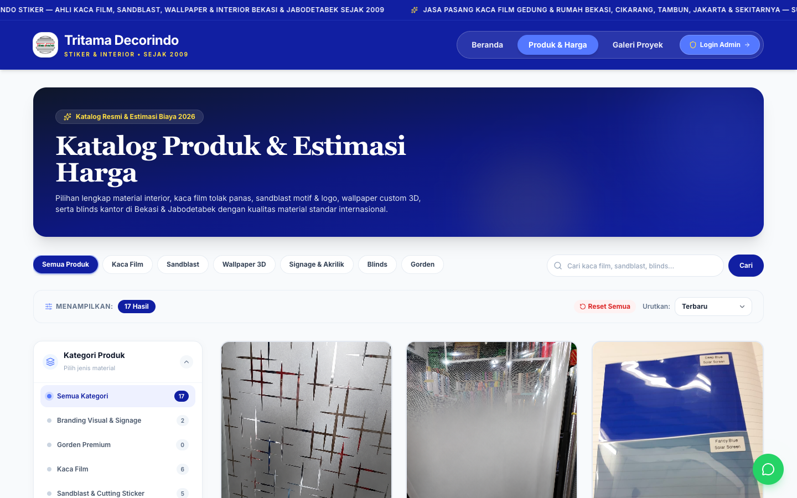

Halaman ini berisi daftar lengkap semua material dan layanan yang tersedia:
- **Filter Kategori**: Pengunjung bisa memfilter tampilan (misalnya hanya ingin melihat "Kaca Film" atau "Sandblast").
- **Kartu Produk**: Menampilkan foto material, nama, kategori, estimasi harga terendah, serta tombol konsultasi cepat via WhatsApp.

---

### 2.3 Halaman Detail Produk & Simulasi Biaya
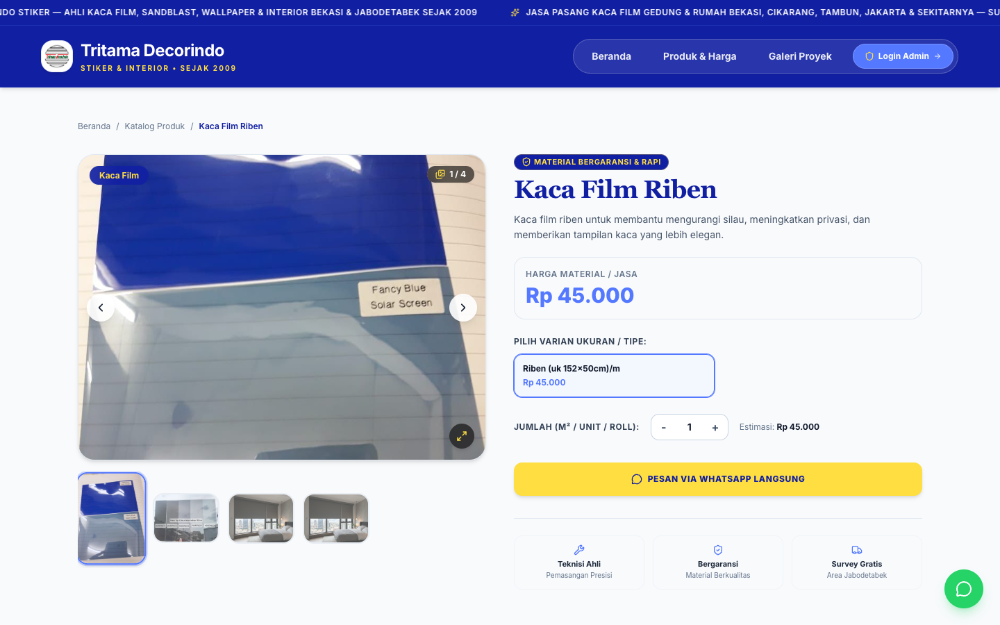

Ketika salah satu produk diklik:
- Pengunjung dapat melihat **galeri multi-foto** dari material tersebut.
- Memilih varian yang diinginkan (misalnya tingkat kegelapan 40%, 60%, atau 80%).
- Membaca deskripsi detail spesifikasi material dan garansi teknisi.
- Mengklik tombol **"Konsultasi Pemasangan via WhatsApp"** yang otomatis mengisi format chat WhatsApp sesuai produk yang sedang dibuka.

---

### 2.4 Galeri Portofolio Hasil Pemasangan
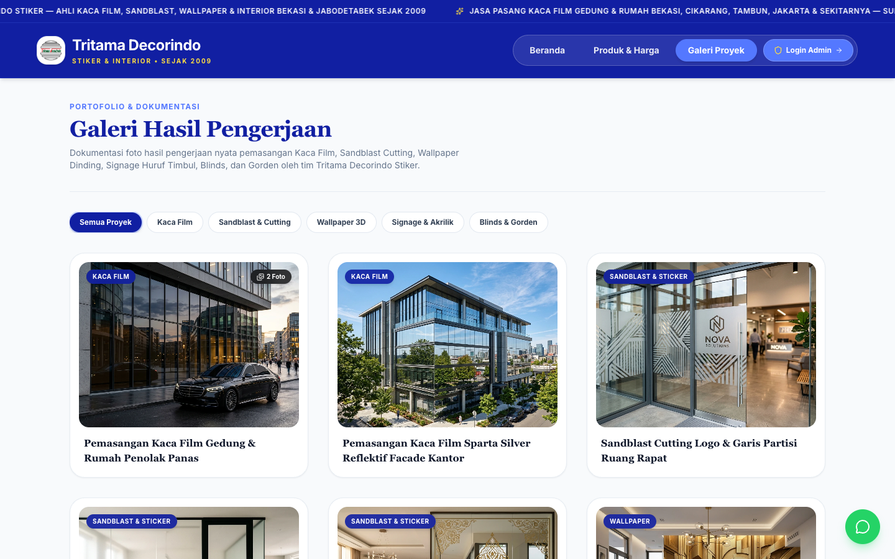

Halaman ini berfungsi membangun kepercayaan pelanggan (*social proof*):
- Menampilkan dokumentasi asli pengerjaan nyata di berbagai kantor, gedung ruko, mall, maupun rumah tinggal.
- Pelanggan dapat melihat kerapian instalasi stiker sandblast logo dan kaca film gedung yang sudah selesai dikerjakan.

---

## 3. Panduan Lengkap Panel Admin (Pengelolaan Toko)

### 3.1 Cara Masuk ke Panel Admin (Login)
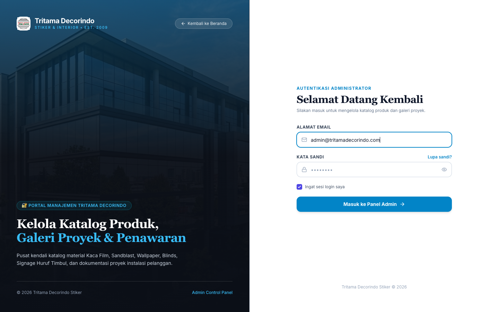

1. Buka alamat website: `https://tritamadecorindostiker.com/login` atau klik tombol **"Login Admin"** di pojok kanan atas halaman website.
2. Masukkan **Alamat Email**: `admin@tritamadecorindo.com`
3. Masukkan **Kata Sandi**: `password123` *(atau kata sandi baru jika sudah diganti)*.
4. Centang kotak *"Ingat sesi login saya"* agar tidak perlu berulang kali mengetik sandi.
5. Klik tombol biru **"Masuk ke Panel Admin"**.

---

### 3.2 Mengenal Menu Dashboard Admin
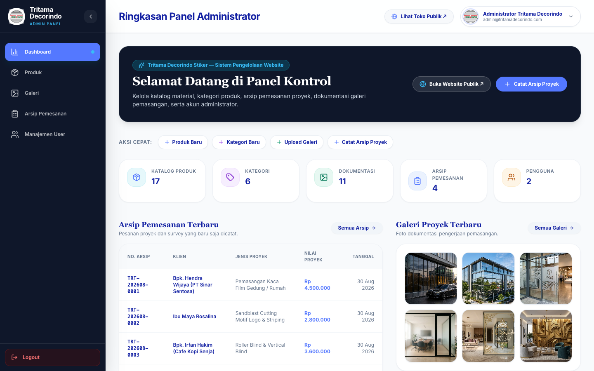

Setelah berhasil masuk, Anda akan disambut di halaman utama panel kontrol:
- **Kartu Statistik Ringkas**: Menampilkan jumlah produk aktif, jumlah kategori, total dokumentasi galeri, arsip pesanan, dan jumlah user admin.
- **Tombol Aksi Cepat**: Tombol pintas untuk langsung menambah produk baru, kategori baru, unggah galeri, atau catat pesanan pelanggan.
- **Tabel Arsip Pemesanan Terbaru**: Menampilkan daftar pelanggan yang baru saja menghubungi atau menjadwalkan survey lokasi.
- **Galeri Terbaru**: Pratinjau 6 dokumentasi proyek terakhir yang diunggah.
- **Menu Samping Kiri (Sidebar)**:
  - 🏠 **Dashboard**: Halaman ringkasan saat ini.
  - 📦 **Produk**: Mengelola katalog material & daftar harga.
  - 🖼️ **Galeri**: Mengunggah foto dokumentasi proyek pemasangan.
  - 📑 **Arsip Pemesanan**: Mencatat transaksi dan invoice pelanggan.
  - 👥 **Manajemen User**: Menambah atau mengelola akun staf admin.

---

### 3.3 Tutorial Kelola Produk (Tambah, Edit, Hapus & Mode Negosiasi WA)

#### A. Melihat Daftar Produk
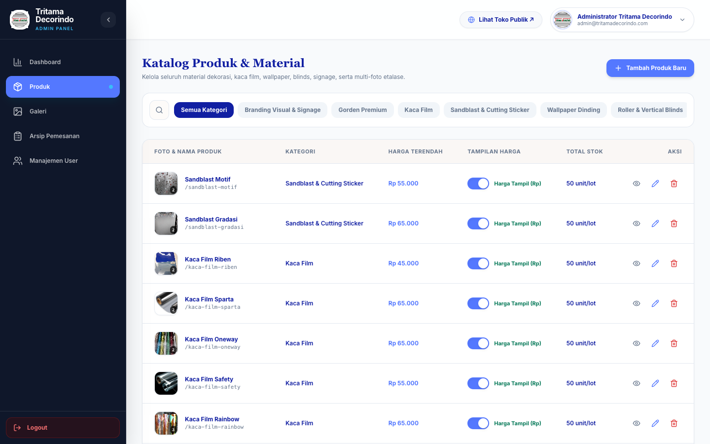

Buka menu **Produk** di sebelah kiri. Di tabel ini Anda dapat:
- Melihat foto, nama produk, kategori, jumlah varian harga, dan status aktif.
- **Switch "Tampilkan Harga"**:
  - Jika tombol **ON (Biru)**: Harga terendah akan tampil di website publik.
  - Jika tombol **OFF (Abu-abu)**: Di website publik tulisan harga akan otomatis berubah menjadi *"Harga Khusus / Nego WhatsApp"* (sangat berguna untuk material borongan yang harganya tergantung luas bidang).
- **Kolom Aksi**: Ada ikon mata (pratinjau di toko), ikon pensil (edit), dan ikon tempat sampah merah (hapus produk).

---

#### B. Menambah Produk Baru
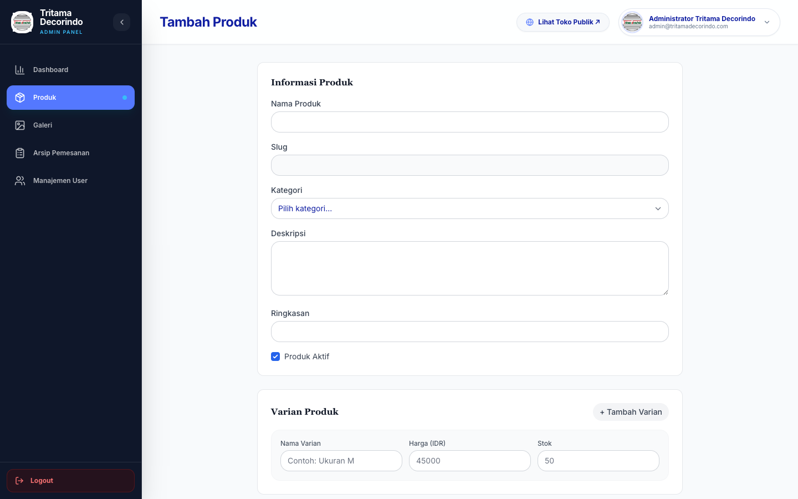

1. Klik tombol biru **"+ Tambah Produk"** di pojok kanan atas halaman Produk.
2. **Nama Produk**: Ketik nama lengkap material (contoh: *Kaca Film Sandblast Motif Bambu*).
3. **Pilih Kategori**: Pilih dari menu drop-down.
4. **Upload Foto Produk**:
   - Anda bisa memilih foto dari komputer/HP (bisa pilih lebih dari 1 foto sekaligus).
   - Format foto yang didukung: JPG, PNG, WEBP.
5. **Ringkasan Singkat & Deskripsi**: Tuliskan keunggulan material dan garansi pengerjaan.
6. **Daftar Varian Harga**:
   - Klik **"+ Tambah Varian"** jika memiliki beberapa pilihan ukuran atau tingkat kegelapan.
   - Contoh varian: Nama: *Roll 50 Meter*, Harga: *1500000*, Stok: *10*.
7. Klik tombol biru **"Simpan Produk"** di bagian bawah. Produk akan langsung tayang di website.

---

### 3.4 Tutorial Tambah Kategori Cepat (Fitur Tombol "+")

Kini Anda **tidak perlu repot membuka halaman lain** hanya untuk membuat kategori baru:
1. Saat sedang mengisi form tambah/edit produk, perhatikan di samping pilihan kategori terdapat ikon tombol lingkaran bertanda **"+" (Tambah Kategori)**.
2. Klik tombol **"+"** tersebut, maka jendela kecil pop-up akan terbuka.
3. Masukkan nama kategori baru (contoh: *Stiker Sandblast 3D Motif*).
4. Klik **"Simpan Kategori"**.
5. Kategori baru otomatis tersimpan ke sistem database dan langsung terpilih di produk yang sedang Anda buat!

---

### 3.5 Tutorial Kelola Galeri Proyek (Dokumentasi Pemasangan Nyata)
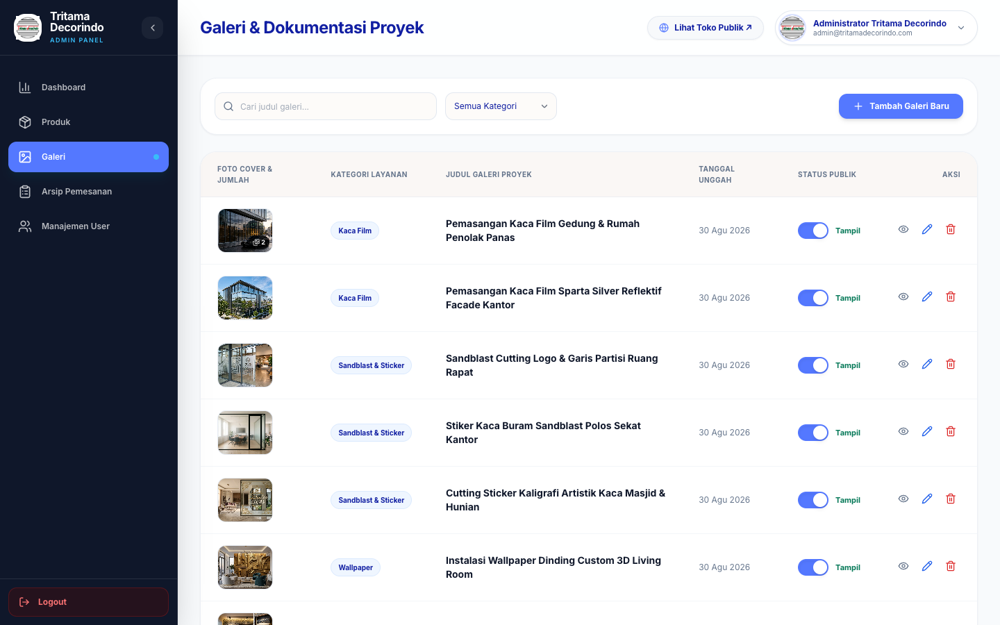

Foto dokumentasi proyek di halaman ini adalah bukti nyata hasil kerja yang meyakinkan calon pelanggan.

1. Buka menu **Galeri** di sidebar kiri.
2. Klik tombol **"+ Tambah Foto Galeri"**.
3. **Pilih Kategori Proyek**: (Contoh: *Kaca Film, Sandblast & Stiker, Wallpaper, Blinds, Signage*).
4. **Judul Proyek**: Beri nama singkat (contoh: *Pemasangan Sandblast Logo Bank Mandiri Bekasi*).
5. **Unggah Foto**: Pilih 1 atau beberapa foto dokumentasi terbaik di lokasi.
6. **Keterangan / Caption**: Tuliskan catatan pengerjaan (contoh: *Pengerjaan 2 hari rapi dan presisi tanpa gelembung*).
7. Klik **"Simpan Galeri"**.
8. **Switch Tampil/Sembunyikan**: Anda bisa menyembunyikan foto kapan saja tanpa menghapusnya, cukup dengan menggeser tombol toggle biru menjadi abu-abu.

---

### 3.6 Tutorial Arsip Pemesanan (Pencatatan Data Pelanggan)
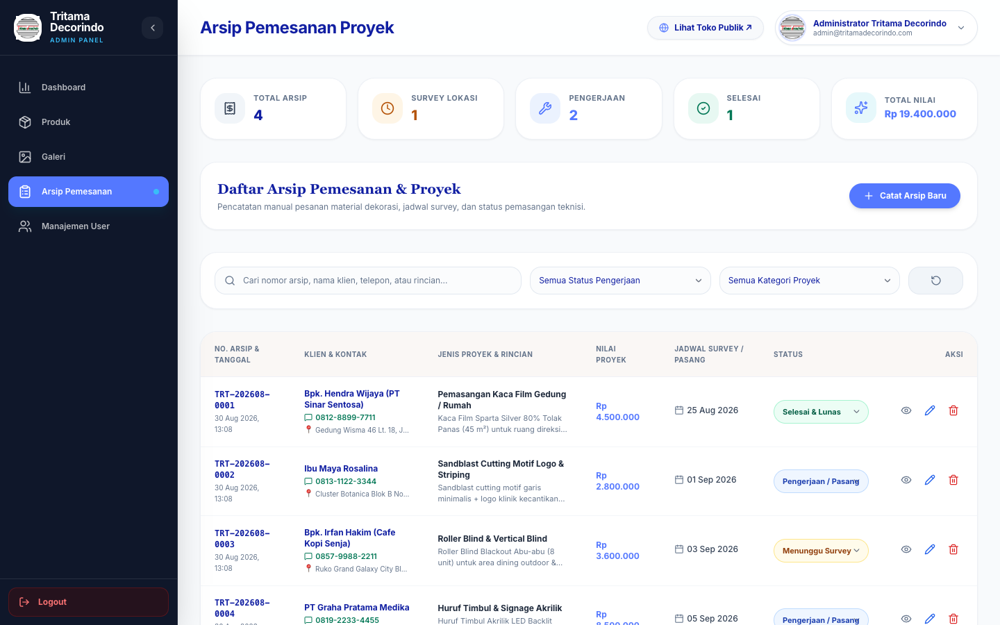

Menu ini berfungsi sebagai buku catatan digital agar data pelanggan tidak hilang di WhatsApp:
1. Buka menu **Arsip Pemesanan**.
2. Klik tombol **"+ Catat Arsip Proyek"**.
3. Masukkan data pelanggan:
   - **Nama Klien / Perusahaan**: (Contoh: *PT Sinar Abadi Perkasa - Bpk. Hendra*).
   - **Nomor Telepon / WA**: (Contoh: *081299887766*).
   - **Jenis Pekerjaan**: (Contoh: *Pasang Kaca Film Sparta 80% Ruang Server*).
   - **Nilai Kontrak / Biaya**: (Contoh: *Rp 4.500.000*).
   - **Status**: Pilih status pengerjaan (*Survey Lokasi, Sedang Dikerjakan, atau Selesai*).
4. Klik **"Simpan Arsip"**.

---

### 3.7 Tutorial Manajemen Akun Pengguna & Admin
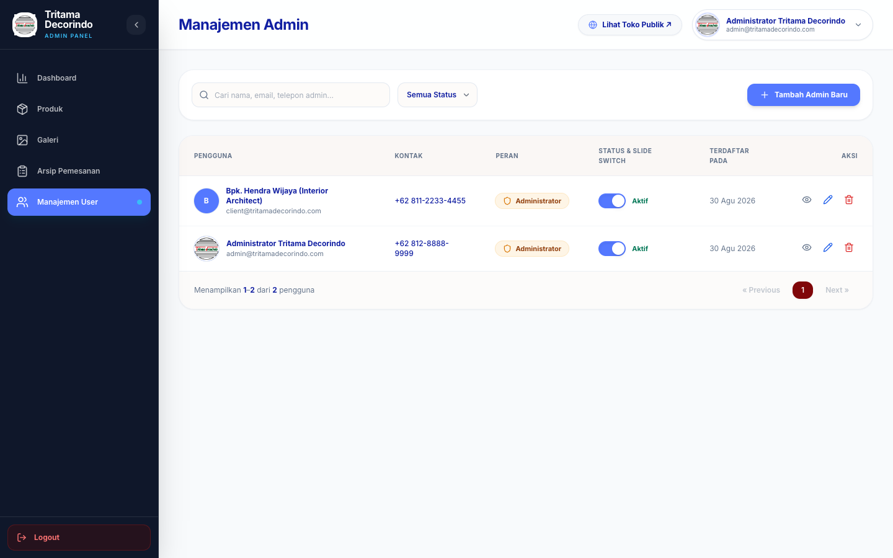

Jika Anda memiliki rekan kerja atau staf yang bertugas mengelola katalog dan dokumentasi:
1. Buka menu **Manajemen User**.
2. Klik tombol **"+ Tambah Pengguna Baru"**.
3. Masukkan Nama Lengkap, Alamat Email, Nomor HP/WhatsApp, dan Kata Sandi untuk staf tersebut.
4. Pilih peran sebagai **Admin**.
5. Klik **"Simpan Pengguna"**.
6. Staf tersebut sekarang bisa login dengan email dan sandi mereka sendiri.

> **Tips Keamanan**: Sistem secara otomatis mencegah akun Anda sendiri terhapus agar Anda tidak terkunci keluar dari sistem admin.

---

### 3.8 Tutorial Ganti Foto & Profil Pribadi Admin
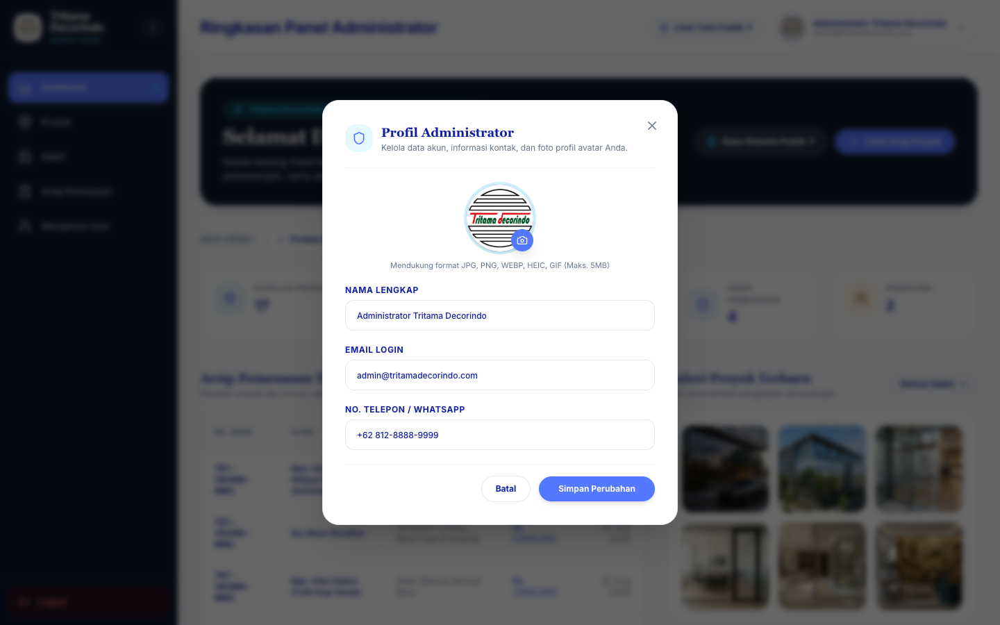

Anda dapat memperbarui identitas dan foto avatar Anda kapan saja:
1. Di halaman panel admin mana saja, lihat ke pojok kanan atas layar.
2. Klik tombol pil yang menampilkan **Foto Avatar & Nama Anda**.
3. Jendela pop-up **Profil Administrator** akan muncul:
   - Klik lingkaran foto untuk memilih foto baru dari komputer/laptop Anda.
   - Ubah Nama Lengkap jika diperlukan.
   - Ubah Alamat Email login.
   - Ubah Nomor WhatsApp admin.
4. Klik tombol biru **"Simpan Perubahan"**. Data dan foto baru langsung aktif seketika.

---

### 3.9 Cara Keluar Akun (Logout) yang Aman

Setelah selesai mengelola website, disarankan untuk keluar demi keamanan:
1. Di sidebar kiri paling bawah, klik tombol merah **"Logout"**.
2. Kotak dialog konfirmasi akan menanyakan kepastian Anda.
3. Klik **"Ya, Keluar Akun"**.
4. Anda akan dialihkan kembali ke halaman utama publik secara aman.

---

## 4. Tips Perawatan & Praktik Terbaik

1. **Ukuran Foto**: Gunakan foto dengan pencahayaan terang dan tajam. Sistem website sudah otomatis mengompres foto agar halaman tetap memuat sangat cepat di HP pengunjung.
2. **Kerapian Judul**: Berikan judul yang jelas pada foto galeri (misal mencantumkan nama daerah atau jenis material), karena ini sangat membantu pengunjung lain yang sedang mencari inspirasi model serupa.
3. **Respon Cepat WhatsApp**: Pastikan nomor WhatsApp yang dimasukkan di profil dan kontak selalu aktif dan dipantau, karena seluruh tombol di website langsung mengarah ke chat WhatsApp resmi Tritama Decorindo.

---

*Dokumen ini diterbitkan khusus untuk manajemen internal PT Tritama Decorindo Stiker.*  
*Versi Aplikasi: 1.0 Production | Pembaruan Terakhir: September 2026*
